# Credentials Folder

## The purpose of this folder is to store all credentials needed to log into your server and databases. This is important for many reasons. But the two most important reasons is
    1. Grading , servers and databases will be logged into to check code and functionality of application. Not changes will be unless directed and coordinated with the team.
    2. Help. If a class TA or class CTO needs to help a team with an issue, this folder will help facilitate this giving the TA or CTO all needed info AND instructions for logging into your team's server. 

# Below is a list of items required. Missing items will causes points to be deducted from multiple milestone submissions.

1. Server IP: `54.215.245.137`
2. SSH username: `ubuntu`
3. SSH password or key: `WebApp.pem`
      If a ssh key is used please upload the key to the credentials folder.
4. Database IP and port used: `funbill-database.cbzocgpmqohp.us-west-1.rds.amazonaws.com` port `3306`
     <strong> NOTE THIS DOES NOT MEAN YOUR DATABASE NEEDS A PUBLIC FACING PORT.</strong> But knowing the IP and port number will help with SSH tunneling into the database. The default port is more than sufficient for this class.
5. Database username: `admin`
6. Database password: `funbill123`
7. Database name (basically the name that contains all your tables): `webapp`
8. Clear instructions with examples on how to use all the above information:
    
    ## STEPS TO PREPARE AND THEN SSH INTO EC2 INSTANCE THEN START THE WEBAPP
    
    1. Before accessing the ec2 instance, download the `WebApp.pem` that is in this credentials directory, then place it in it's own folder
          You may need to edit the properties of this file if the steps following this throw an error says:
          `@@@@@@@@@@@@@@@@@@@@@@@@@@@@@@@@@@@@@@@@@@@@@@@@@@@@@@@@@@@`
          `@         WARNING: UNPROTECTED PRIVATE KEY FILE!          @`
          `@@@@@@@@@@@@@@@@@@@@@@@@@@@@@@@@@@@@@@@@@@@@@@@@@@@@@@@@@@@`
           If you are on windows follow these steps: 
         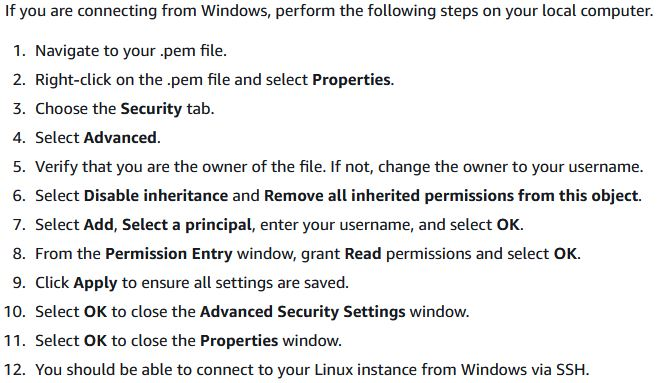
           If you are on Linux or Mac, follow these steps in the terminal:
         
         replace the path after `600` with the path to the `WebApp.pem` that was downloaded
          
         replace the path after `755` with the path to the folder that contains `WebApp.pem` that was downloaded
           
    
    2. Open command prompt or terminal and input 
         `ssh -i secret/WebApp.pem ubuntu@e54.215.245.137`
         and replace `secret/WebApp.pem` with the path to the WebApp.pem that was downloaded previously
         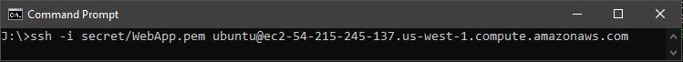
          This should be displayed
         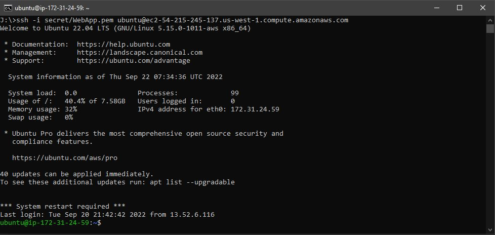
          <strong>IF ALL YOU NEED TO DO IS SSH INTO THE EC2 INSTANCE STOP HERE</strong>   
   
    3. Type `cd horizontalprototype` to open the projects directory
         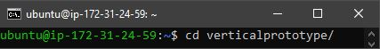
          
        
    4. Type `npm start` to start the web application
         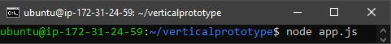
          This should display:
         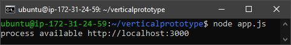
           
    
    5. Open a internet browser and type `54.215.245.137:3000` into the address bar
          A website similar to this should display:
         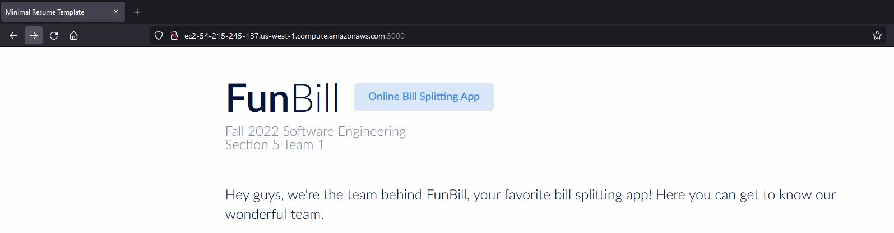
              
    
    ## STEPS TO SET UP AND CONNECT TO THE MYSQL DATABASE THROUGH MYSQL WORKBENCH
    
    1. Open up mysql workbench
         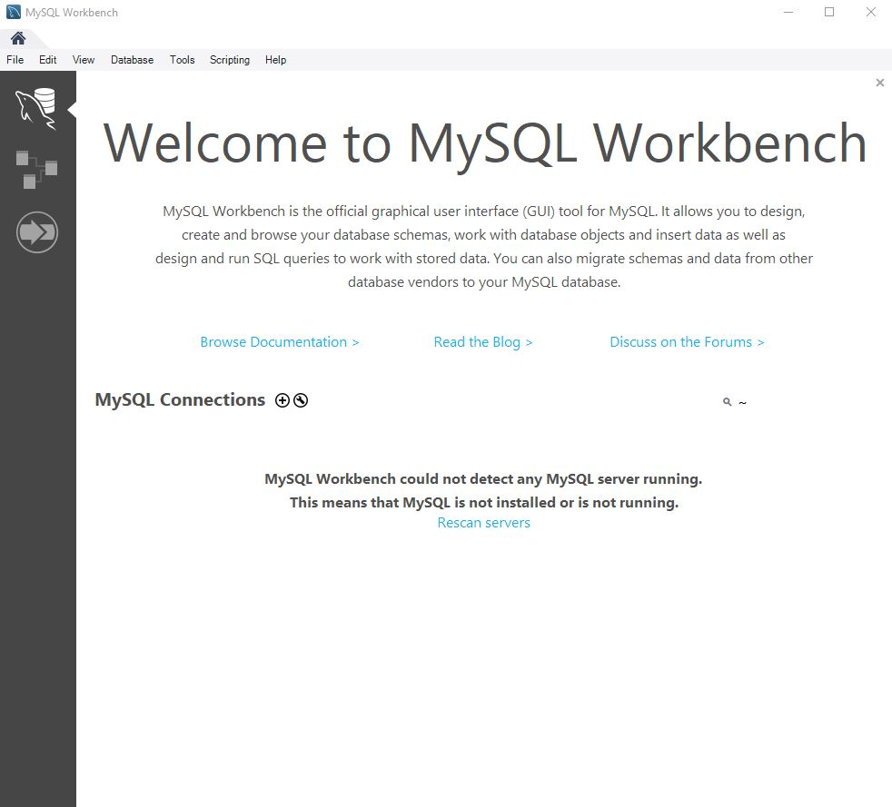
         Click on the <strong> plus </strong> sign:  to add a connection
           
        
    2. This window will display:
         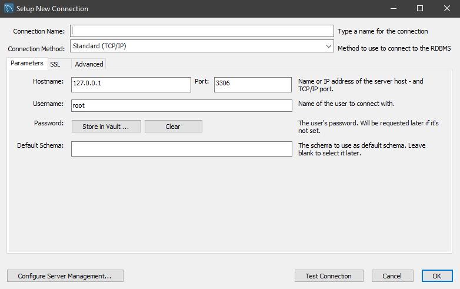
           Open the `Connection Method` drop down menu and select `Standard TCP/IP over SSH`:
         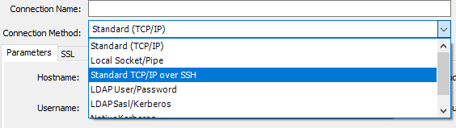
          Fill out the parameters accordingly:
         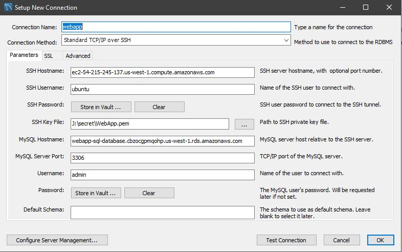
          SSH Hostname: `54.215.245.137`
          SSH Username: `ubuntu`
          SSH Key File: Click the button on the right and select the path to `WebApp.pem`
          MYSQL Hostname: `funbill-database.cbzocgpmqohp.us-west-1.rds.amazonaws.com`
          MySQL Server Port:`3306`
          Username:`admin`
           
        
    3. Click `Test Connection` at the bottom:
          This window will display:
         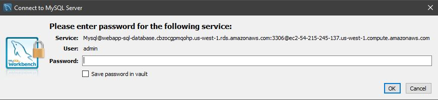
           Enter the password: `funbill123`
            <strong> IF THIS WINDOW DID NOT POP UP AND A ERROR SHOWS THEN ONE OF THE PREVIOUS FIELDS IS WRONG </strong>
           
        
    4. Click `OK` in the `Setup New Connection` window then the connection to webapp has been successfully created:
         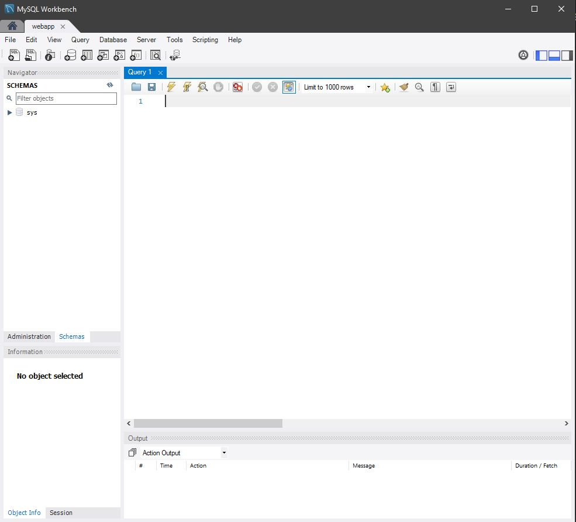
        

# Most important things to Remember
## These values need to kept update to date throughout the semester.  
## <strong>Failure to do so will result it points be deducted from milestone submissions.</strong> 
## You may store the most of the above in this README.md file. DO NOT Store the SSH key or any keys in this README.md file.
